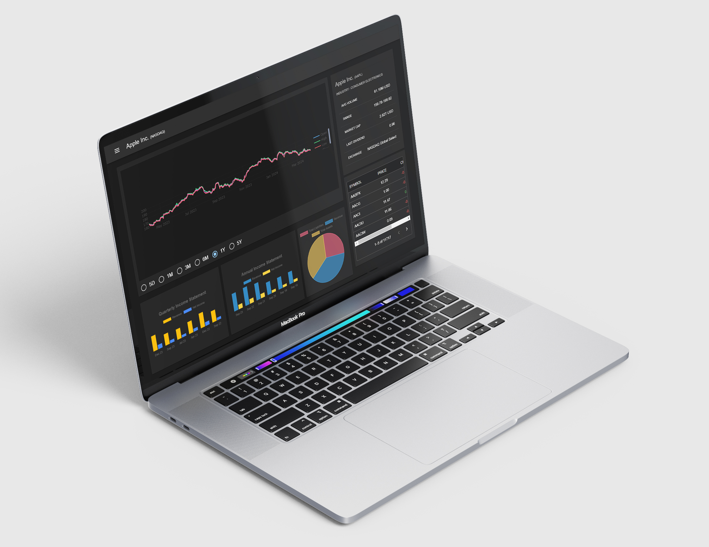

# Interactive Stock Market Visualization

## Description

On this Interactive Stock Market Visualization project, we're revolutionizing stock market analysis with dynamic, user-friendly visualizations. Our platform provides real-time access to market data, empowering users to make informed decisions and uncover trends effortlessly. Join us as we redefine how you engage with the stock market.



## Installation

1. **Clone the repository:**

2. **Navigate to the project directory:**

    ```
    cd Stock-Market-Visualization
    ```

3. **Install dependencies:**

    ```
    npm install
    ```

## Tech Stack

- **React:** The project is built using React, a popular JavaScript library for building user interfaces.
- **axios:** Used for making HTTP requests to fetch data from the API.
- **Chart.js:** A simple yet flexible JavaScript charting library for creating interactive charts.
- **moment:** A JavaScript library for parsing, validating, manipulating, and formatting dates.
- **Plotly.js:** A JavaScript library for creating interactive, publication-quality graphs.
- **react-chartjs-2:** A React wrapper for Chart.js, allowing seamless integration of Chart.js into React applications.
- **react-dom:** Provides DOM-specific methods for React components.
- **react-plotly.js:** A React wrapper for Plotly.js, enabling the use of Plotly.js within React applications.

## Usage

1. **Before running the project, ensure you have obtained the necessary API token from [IEX Cloud](https://iexcloud.io/). This token should be stored in an environment variable named `VITE_TOKEN`.**

2. **To run the project in development mode, execute the following command:**

    ```
    npm run dev
    ```

    This will start the development server.

3. **To build the project for production, run:**

    ```
    npm run build
    ```

    This will generate a production-ready build in the `dist` directory.

4. **To serve the production build locally, run:**

    ```
    npm run serve
    ```

    This will serve the production build on a local server.

## Environment Variables

- **`VITE_TOKEN`:** This environment variable should contain the API token obtained from [IEX Cloud](https://iexcloud.io/).

    Make sure to set this variable before running the project.

## Contributors

- Morteza Mogharrab
- Solehin Islam
- Ameer Un Nisa
